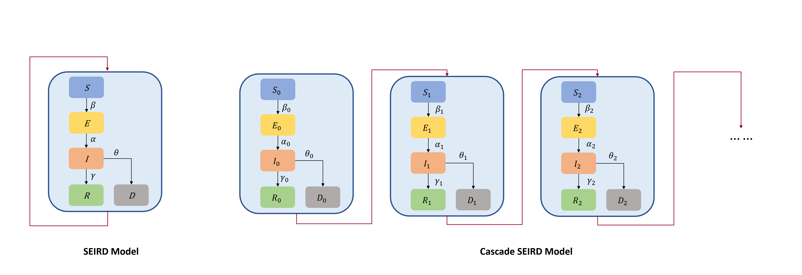
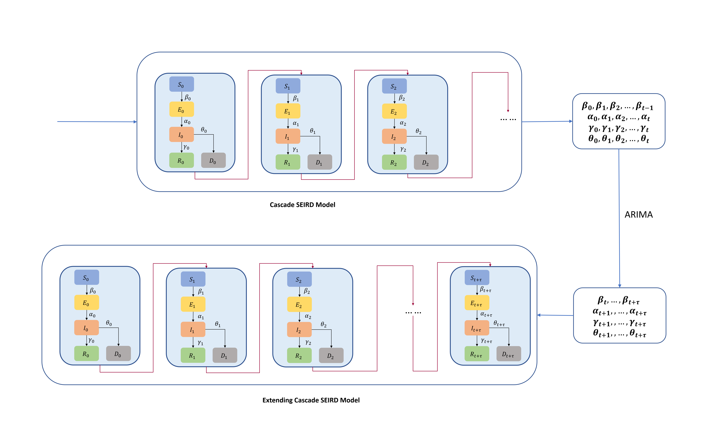

# Cascade SEIRD
This is a Pytorch implementation of Cascade SEIRD and predict the parameters with ARIMA to extending the Cascade SEIRD model.

## Setup
Required python libraries: pmdarima, torch, numpy, pandas, matplotlib

## Datasets
We conduct experiments on our dataset in ./ncov/data

Use the run.py script to train the model. 
```
python run.py
```
## Architecture



## Pipeline

